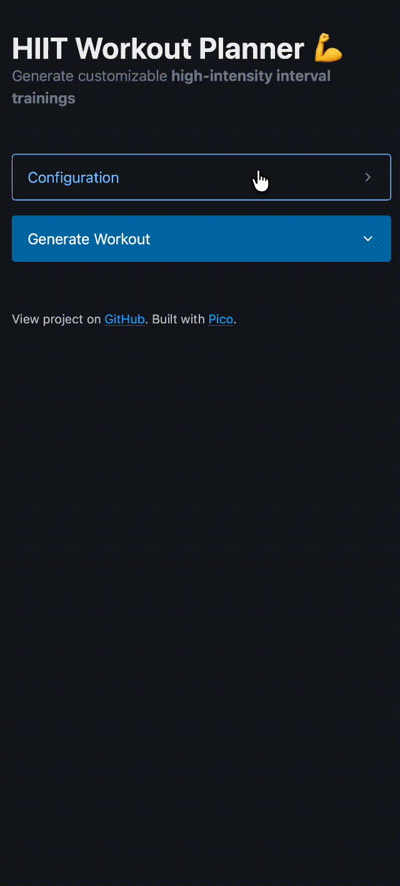

# HIIT Workout Planner 💪

Generate flexible HIIT workouts in seconds.

Try the [live version](https://tim-fuchs.github.io/hiit-workout-planner/ "Live Version") and generate a high-intensity interval training with just one click.

## Features

- Create workouts tailored to your focus areas:
  - 💪 Chest + Arms
  - 🧘 Abs
  - 🦵 Legs
- Set exactly how many rounds you want to train
- Control how often the category changes
- Generate a fresh randomized workout every time

## Tech Stack

- HTML, CSS, and JavaScript
- [Pico](https://picocss.com "Pico website") for lightweight styling
- GitHub Pages for automatic deployment

## Project Structure

*Coming soon*

## Run Locally

1. Clone the repository.
2. Open `index.html` in your web browser.

## Testing

*Coming soon*

## Deployment

Every push to `main` automatically deploys the latest version to GitHub Pages.

## Contributing

*Coming soon*

## License

Licensed under the [MIT license](./LICENSE "LICENSE file").
